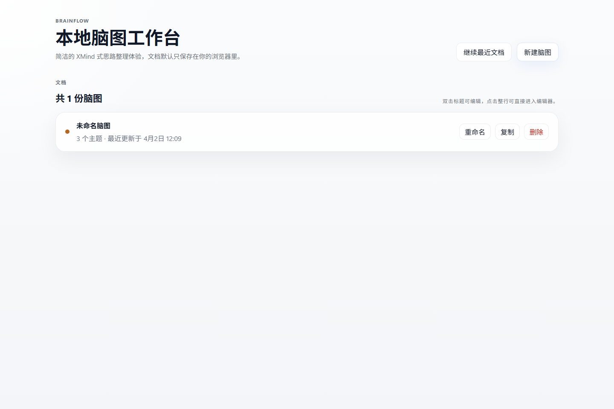
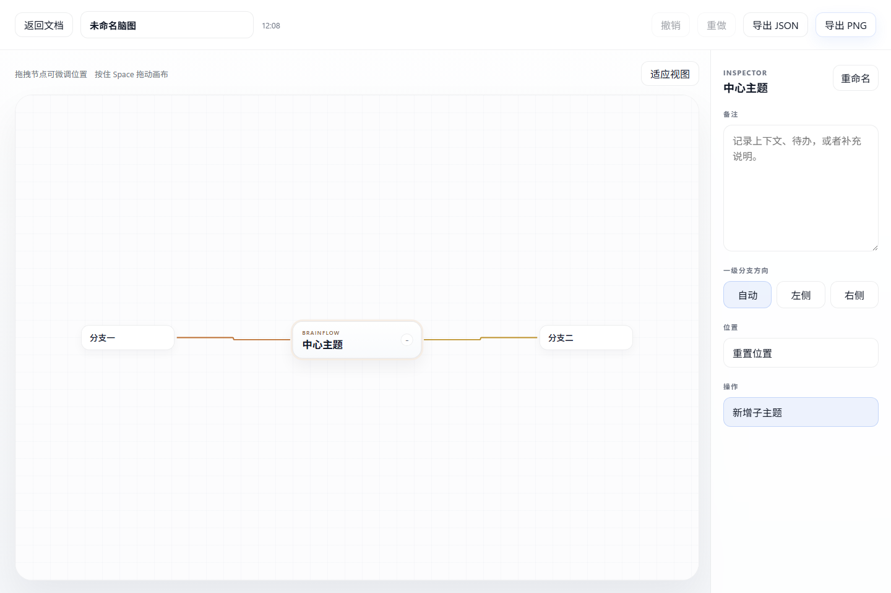

# BrainFlow

BrainFlow 是一个本地优先的 Web 脑图工具，融合经典脑图编辑体验与 AI 协作能力，支持多 AI 提供商、用户认证与云同步。

## 核心特性

### 脑图编辑
- **经典布局**：根节点居中，一级分支左右展开，自动布局算法
- **手工微调**：在自动布局基础上拖拽微调节点位置
- **主题类型**：普通主题、里程碑、任务三种类型，不同视觉标识
- **节点样式**：自定义背景色、文字色、分支色，多种预设风格
- **层级导航**：左侧目录面板快速浏览和定位节点

### AI 协作
- **多 Provider 支持**：Codex（本地）、DeepSeek、Kimi（月之暗面）可切换
- **前端热切换**：在 AI 设置页面直接配置 API Key 和切换 Provider
- **智能对话**：基于当前脑图上下文与 AI 对话
- **节点操作**：AI 可自动创建、更新、删除脑图节点
- **Markdown 智能导入**：将 Markdown 文件解析为脑图结构
- **会话管理**：多会话切换、重命名、归档
- **AI 锁定**：锁定节点防止 AI 修改，保护关键内容

### 节点详情
- **富文本备注**：支持详细内容编辑
- **标签系统**：为主题添加标签分类
- **任务管理**：任务状态（待办/进行中/已完成）和优先级
- **链接与附件**：网页链接、主题链接、本地资源链接

### 标记与格式
- **标记**：重点、问题、灵感、风险、决策、阻塞等状态标记
- **贴纸**：多种 Emoji 贴纸装饰节点
- **主题预设**：一键切换整体配色方案
- **画布样式**：自定义背景色、强调色、分支色板

### 数据管理
- **本地优先**：数据存储在浏览器 IndexedDB，无需注册即可使用
- **云同步（可选）**：登录后支持 PostgreSQL 云端同步，多设备互通
- **用户认证**：内置密码认证，支持管理员与普通用户角色
- **自动保存**：实时自动保存编辑内容
- **导入导出**：JSON、PNG 导出，Markdown 导入
- **撤销重做**：完整的历史记录管理

## 截图

| 文档工作台 | 脑图编辑器 |
| --- | --- |
|  |  |

## 快速开始

### 环境要求

- Node.js 20+
- pnpm 9+

### 本地开发

```bash
pnpm install
pnpm dev
```

默认访问地址：`http://localhost:5173/`

仅前端（不需要 AI 功能）：

```bash
pnpm dev:web-only
```

### 常用命令

```bash
pnpm dev              # 启动前端 + AI 服务
pnpm dev:web-only     # 仅启动前端（端口 4173）
pnpm dev:server       # 仅启动 AI 服务
pnpm build            # 构建生产版本（前端 + 服务端）
pnpm build:web        # 仅构建前端
pnpm build:server     # 仅构建服务端
pnpm preview          # 预览构建产物
pnpm lint             # 代码检查
pnpm test             # 单元测试
pnpm test:e2e         # E2E 测试
```

### AI Provider 配置

在 `.env.local` 中配置：

```bash
# 选择 Provider: codex | deepseek | kimi
BRAINFLOW_AI_PROVIDER=deepseek

# DeepSeek
DEEPSEEK_API_KEY=sk-xxx
DEEPSEEK_MODEL=deepseek-chat

# Kimi (Moonshot AI)
KIMI_API_KEY=sk-xxx
KIMI_MODEL=moonshot-v1-32k
```

也可在前端 AI 设置页面直接配置和切换。详见 [AI Provider 配置指南](docs/AI_PROVIDER_SETUP.md)。

### 数据库配置（可选，云同步用）

```bash
pnpm db:up            # 启动本地 PostgreSQL
pnpm backup:postgres  # 备份数据库
```

## 部署

### Vercel（纯前端）

已提供 [vercel.json](vercel.json) 配置：

- Framework Preset: `Vite`
- Install Command: `pnpm install --frozen-lockfile`
- Build Command: `pnpm build:web`
- Output Directory: `dist`

### 完整部署（前端 + AI 服务）

1. 构建：`pnpm build`
2. 启动服务：`pnpm start:server`（端口 8787）
3. 前端 `dist/` 部署到任意静态托管
4. 配置 SPA 回退到 `/index.html`

详见 [部署文档](docs/deployment.md) 和 [deploy/](deploy/) 目录。

## 技术栈

- **前端**：React 19 + TypeScript + Vite 8
- **状态管理**：Zustand
- **脑图引擎**：@xyflow/react
- **AI 服务**：Hono + OpenAI SDK（多 Provider 适配）
- **数据库**：PostgreSQL（云同步）+ IndexedDB（本地存储）
- **认证**：内置密码认证
- **测试**：Vitest + Playwright

## 项目结构

```text
src/
  components/            # 通用组件（节点、图标、UI 控件）
  features/
    ai/                  # AI 会话、Provider 切换
    auth/                # 用户认证
    documents/           # 文档模型、主题类型
    editor/              # 编辑器状态、布局引擎、导出
    import/              # Markdown 导入
    storage/             # 存储抽象层（本地 + 云同步）
  pages/
    home/                # 文档工作台首页
    editor/              # 脑图编辑器页面
    ai-settings/         # AI 设置页面
server/
  auth/                  # 认证中间件
  providers/             # AI Provider 实现（Codex/DeepSeek/Kimi）
  repos/                 # 数据库 Repository
  services/              # 业务服务
  prompts/               # AI Prompt 模板
```

## 当前边界

- 不兼容 XMind 等第三方脑图格式
- 拖拽仅支持位置偏移，暂不支持修改父子结构
- 移动端适配以查看为主，完整编辑建议桌面端使用

## License

MIT
